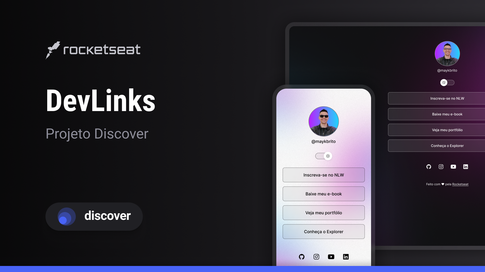

# Rocketseat - Discover

## Tecnologias

Esse projeto foi desenvolvido com as seguinter tecnologias:

- HTML e CSS
- JavaScript
- Git e Github
- Figma

## Projeto

O DevLinks é um agregador de links para usar como cartão de visitas online.

## Layout

Você pode visualizar o layout através [DESSE LINK](https://www.figma.com/community/file/1187422022288947321). É necessário ter conta no [FIGMA](https://figna.com) para acessá-lo.

## Licença

Esse projeto está sob a licença MIT.

---
Feito com ❤ by Rocketseat :wave: [Participe da nossa comunidade!](https>//discord.gg/rocketseat)